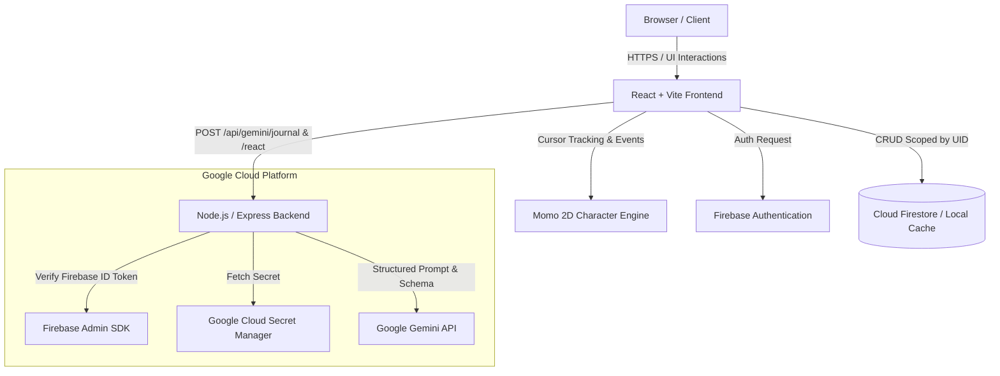

# Momo Journal — Architecture & System Design

## 1. High-Level Architecture

## 2. Core Components

### Frontend
- **Framework**: React 18 + TypeScript + Vite.
- **Styling**: Tailwind CSS with cozy warm palettes (cream/peach in light mode, deep charcoal in dark mode), subtle glassmorphism (`backdrop-filter`), custom soft scrollbars, and `Lora`/`Plus Jakarta Sans` typography.
- **State Management**:
  - `CharacterContext`: Global state for Momo (states, emotions, speech bubbles, zone targets, wake/celebrate methods).
  - `AuthContext`: Firebase authentication + Instant zero-config demo switcher.
  - `SettingsContext`: Preferences for Momo size, movement, reduced motion, sound/text bubbles.
  - `ThemeContext`: Dark/Light theme switching.

### Character Engine (Momo)
- **Renderer (`MomoCharacter.tsx`)**: High-polish SVG vector rendering with dynamic look-angles for pupil tracking, breathing body bounce, ear twitching, happy/sad/sleepy mouth shapes, tail animation, and particle bursts (zzz, stars, hearts).
- **Physics & Motion (`MomoEngine.tsx`)**:
  - Smooth damped interpolation (`lerp`) with comfortable leash distance (Momo stays 100-140px away, never obscuring user input or click targets).
  - Inactivity progression:
    - 10s: Look around
    - 20s: Sit
    - 40s: Lie down
    - 60s: Sleep (`zzz...`)
    - Mouse movement or keypress immediately wakes Momo up.
  - Speech bubble manager with audio-visual short expressions (1-4 words) and 5-8 second cooldowns.

### Backend API (`server/`)
- **Express + TypeScript**: Secure backend proxy ensuring the `GEMINI_API_KEY` is never exposed to the client.
- **Middleware**:
  - `verifyAuth`: Validates Firebase ID tokens using `firebase-admin` or handles isolated demo user tokens.
  - `geminiRateLimiter`: Sliding-window rate limiter (30 req/min).
  - `helmet`: Security headers.
  - `cors`: Restricted cross-origin resource sharing.
- **Gemini Service (`services/gemini.ts`)**:
  - Structured JSON response schema enforcement using `@google/genai` and `Zod`.
  - Smart offline / demo fallback engine providing emotional reflections even when no API key is supplied.

## 3. Data Model & Privacy Boundary
- Firestore path: `/users/{uid}/entries/{entryId}`
- Each journal entry stores:
  - `id`: Unique string
  - `userId`: Authenticated Firebase UID
  - `title`: String
  - `content`: String
  - `createdAt` / `updatedAt`: ISO timestamps
  - `wordCount`: Number
  - `tags`: Array of strings
  - `moodHint`: Emotion category
  - `characterReaction`: Structured object (`emotion`, `action`, `expression`, `sound`, `intensity`)
